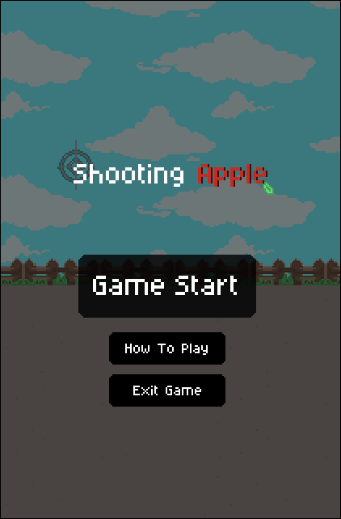
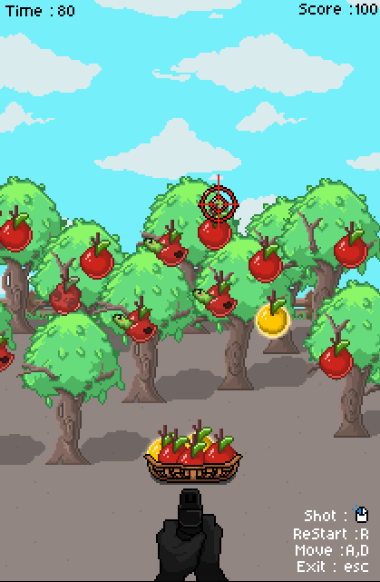
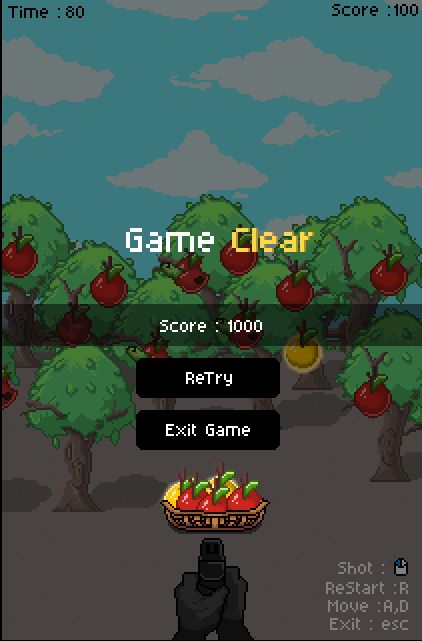
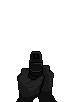
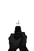
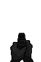
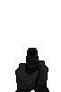
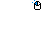

# 2차 과제 게임 기획서

## 게임 제목

- Shooting Apple

- 장르 : 1인칭 슈팅(FPS) + 퍼즐 + 스코어 어택

---

## 게임 레퍼런스

- 사과게임 フルーツボックス (후르츠 박스 / Fruit Box)

### 레퍼런스 게임의 주요 규칙

- 사과에 랜덤한 숫자가 적혀있음

- 두 개 이상의 사과를 드래그로 박스에 담아서 사과의 숫자 합이 10이 되면 점수를 얻고,
  얻은 사과는 화면에서 제거되는 형식
  
- 매 판마다 랜덤한 숫자가 배정됨

- 사과를 한 번에 많이 제거할수록 점수가 높아짐 (추가점수는 없음)

- 제거된 사과의 자리는 자동으로 채워지지 않고 빈 공간으로 남음

- 바구니 안에 빈 공간이 있을 경우 해당 빈 공간은 합산되지 않음

### 추가 설정

- 기존 퍼즐 요소에 1인칭 FPS 요소 추가

---

## 게임 개요

- 플레이어는 제한시간 90초 동안 사과나무에 달린 사과의 꼭지를 원거리 수확 장비로 정확히 맞혀 떨어뜨림

- 떨어지는 사과는 플레이어와 함께 좌우로 움직이는 바구니로 받아야 함

- 바구니에 담긴 사과의 숫자 합이 정확히 10이 되면 수확 성공으로 판정되어 점수를 획득함

- 상태가 좋은 사과일수록 높은 점수를 얻을 수 있으며, 상태가 좋지 않은 사과는 감점 요소가 됨

- 제한시간 종료 후 획득한 최종 Score로 대회 결과를 확인하는 1인용 스코어 어택 게임

---

## 게임 목적

- 제한시간 90초 안에 가능한 많은 사과를 수확

- 바구니에 담긴 사과 숫자의 합을 정확히 10으로 만들어 점수를 획득

- 황금 사과 등 좋은 사과를 활용하여 높은 점수를 노림

- 합계가 10을 초과하여 바구니가 파손되는 상황을 최대한 피함

- 최종적으로 가장 높은 Score를 기록하는 것이 목표

---

## 게임 스토리

- 매년 한 번, 사과 농장 마을에서는 특이한 방식의 사과 수확 대회가 열린다

- 이 대회에서는 손으로 사과를 따는 것이 금지되어 있으며,  
  참가자는 반드시 총으로 사과의 꼭지만 정확히 맞혀 사과를 떨어뜨린 뒤 바구니에 받아야 한다
  
- 주인공은 사격 실력에는 자신이 있지만 형편이 넉넉하지 않아,  
  농장 수리비와 생활비를 마련하기 위해 대회의 상금을 노리고 참가한다

---

## 조작 방법

- 사격 : 마우스 좌클릭

- 조준 : 마우스 이동

- 이동 : A, D

- 재시작 : R

- 종료 : ESC

> 플레이어는 1인칭 시점에서 좌우로만 이동

---

## 게임 규칙
--기본 규칙--

    - 여러 종류의 특수 사과 등장
		
    - 사과 꼭지를 사격하면 해당 사과가 나무에서 떨어짐
		
    - 플레이어는 A,D로 좌,우 이동하며 떨어지는 사과를 바구니로 받아야함
		
	- 바구니에 담긴 2개 이상의 사과는 합계 10 이 되면 점수를 획득하고 바구니가 초기화됨
		
    - 바구니에 담긴 사과의 숫자 합계가 10 초과가 되면 바구니가 파손되며
	  해당 조합에는 점수를 부여하지 않고 바구니가 초기화됨
	  
    - 바구니에 담긴 사과의 숫자 합계가 10 미만이면 계속해서 사과를 수확할 수 있음

### 특수 사과 규칙

-바구니의 합계가 10 이 되었을때 사과 종류에 따라 추가점수 또는 감점이 적용됨
		
	 - 황금 사과 : +20 Score
	 
     - 멍든 사과 : -5 Score
	 
     - 벌레먹은 사과 : -10 Score

- 바구니가 파손된 경우에는 특수 사과의 추가점수 및 감점도 적용되지 않음

---

## 점수 / 승부 규칙

--기본 Score 계산--

    - 기본 Score = 바구니에 담긴 사과 개수 × 10

    - 추가 Score = (사과 개수 - 2) × 10

    - 추가 Score는 3개 이상의 사과로 합계 10을 만들었을 때부터 적용
	

--Score 예시--

	- 2개 = 20 Score
	- 3개 = 30 Score + 추가 Score 10 = 40 Score
	- 4개 = 40 Score + 추가 Score 20 = 60 Score ...
	

--특수 사과 Score--

    - 황금 사과가 포함된 성공 조합 : 사과 1개당 +20 Score
	
    - 멍든 사과가 포함된 성공 조합 : 사과 1개당 -5 Score
	
    - 벌레먹은 사과가 포함된 성공 조합 : 사과 1개당 -10 Score

### 승부 방식

- 1인용 스코어 어택 방식으로 진행

- 제한시간 종료 시 획득한 최종 Score가 플레이 결과가 됨

- 높은 Score를 기록할수록 대회에서 더 좋은 성적을 거둔 것으로 표현

---

## 게임 시작 조건

- 게임 실행 후 Game Start Button을 클릭하면 게임시작

- 게임 시작과 동시에 제한시간 90초 카운트가 시작됨

- 사과가 나무에 생성되고, 플레이어의 조준 및 이동 입력이 활성화됨
- 시작 시 Score는 0으로 초기화되고 바구니도 빈 상태로 시작함

---

## 게임 종료 조건

- 제한시간 90초가 모두 지나면 게임을 종료함

- 게임 종료 후 최종 Score를 표시함

- 결과 화면에는 최종 Score와 함께 사과가 담긴 바구니 이미지를 표시함

- R 키를 누르면 게임을 다시 시작할 수 있고, ESC 키를 누르면 게임을 종료함

---

## 플레이어 행동

- 마우스로 조준점을 움직여 사과의 꼭지를 조준

- 마우스 좌클릭으로 원거리 수확 장비를 발사

- 명중한 사과는 나무에서 떨어짐

- 플레이어는 A, D 키를 이용해 바구니와 함께 좌우로 이동함

- 떨어지는 사과를 바구니로 받아 숫자 합계를 관리함

- 현재 바구니 합계를 고려하여 다음에 어떤 사과를 떨어뜨릴지 선택함

---

## 적, 장애물, 아이템 등의 행동

-적

    - 별도의 적 캐릭터는 등장하지 않음

---장애 요소---

    - 사과 숫자 합계가 10을 초과하면 바구니가 파손되고 해당 조합의 점수를 얻지 못함
    - 제한시간이 계속 감소하므로 빠른 조준과 판단이 필요
    - 멍든 사과와 벌레먹은 사과는 성공 조합에 포함될 경우 감점 요소가 됨

--아이템 / 특수 오브젝트--

    - 일반 사과 : 기본 점수 계산에 사용
	
    - 황금 사과 : 성공 조합에 포함되면 추가점수 제공
	
    - 멍든 사과 : 성공 조합에 포함되면 감점
	
    - 벌레먹은 사과 : 성공 조합에 포함되면 더 큰 감점

---

## 게임 화면 구성

- 기준 화면 크기 : 420 × 640

- 화면 상단 좌측 : 남은 제한시간

- 화면 상단 우측 : 현재 Score

- 화면 중앙 : 사과나무와 수확 가능한 사과

- 마우스 위치 : 조준점

- 화면 하단 : 원거리 수확 장비(1인칭 스프라이트)

- 화면 우측 하단 : 간단한 조작법

- 화면 하단 또는 플레이어 위치 : 수확용 바구니

- 결과 화면 : 최종 Score + 사과가 담긴 바구니 이미지 + 재시작/종료 안내

--화면 레이어 순서--

    1. 하늘 배경
	2. 바닥 배경
	3. 울타리
    4. 사과나무
    5. Score / Time / 결과 UI
    6. 바구니 뒷면
    7. 나무에 달린 사과 / 떨어지는 사과
    8. 바구니 앞면
	9. 원거리 수확 장비(권총)
    10. 조준점
---

## 게임 진행 흐름

   - Game Start Button 클릭 (게임 처음에만)
   
   -> 사과 생성
   
   -> 마우스로 조준
   
   -> 사과 사격
   
   -> 사과 나무에서 낙하
   
   -> A,D 로 바구니와 함께 이동
   
   -> 바구니로 사과 획득
   
   -> 담은 사과의 숫자 합산
   
   -> 사과 숫자 합계 10 여부 확인
   
         -10 미만 -> 계속 수확
	     -10 도달 -> 점수 계산 / 바구니 초기화
	     -10 초과 -> 바구니 파손 (초기화) / 점수없음
   
  *단, 특수 사과에 경우(황금 사과, 멍든 사과, 벌레먹은 사과), 바구니가 부서졌을때(합계 10 초과)는 점수없음 *

---

## 주요 게임 객체 목록

- Player : 1인칭 시점의 플레이어, A/D 이동

- HarvestTool : 원거리 수확 장비, 사격 애니메이션

- Crosshair : 마우스 위치를 따라 이동하는 조준점

- Apple : 일반 사과 및 특수 사과의 기본 객체

- Basket : 떨어지는 사과를 받으며 현재 숫자 합계를 보관

- AppleTree : 사과가 생성되는 배경 오브젝트

- GameTimer : 제한시간 90초 관리

- ScoreSystem : 기본 점수, 다중 수확 보너스, 특수 사과 점수 관리

- ResultScreen : 최종 Score와 결과 이미지 표시

---

## 필요한 이미지 목록

--사과 종류--

    - 일반 사과
    - 황금 사과
    - 멍든 사과
    - 벌레먹은 사과

### 플레이 관련

    - 원거리 수확 장비(총 모양 리소스)

    - 원거리 수확 장비 대기/이동 애니메이션 프레임

    - 원거리 수확 장비 사격 애니메이션 프레임

    - 마우스 조준점

    - 수확용 바구니(기본)

    - 수확용 바구니(파손)

    - 바구니 뒷면 / 바구니 앞면(사과를 사이에 표시할 경우)
	
	- 사과나무(2가지)
	
	- 농장 배경 하늘
	
	- 농장 배경 바닥
	
	- 울타리
	
	- 그 외 Text UI 이미지, 버튼 이미지
	
	
---

## 필요한 사운드 목록

- 원거리 수확 장비 발사 효과음

- 사과 꼭지 명중 효과음

- 사과 낙하 효과음

- 바구니에 사과가 들어가는 효과음

- 숫자 합계 10 성공 효과음

- 바구니 파손 효과음

- 제한시간 종료 효과음

- 결과 화면 효과음

- 배경음악(BGM) - 아직 없음

---

## 게임 화면 구성

### Scene 1 - 게임 시작화면

- 중앙 : 게임 제목 표시, Game Start 버튼 표시

- 중앙 아래 : 게임 설명 버튼 표시, 게임 종료 버튼 표시

---

### Scene 2 - 게임 플레이 화면

- 좌측 상단 : 제한시간 표시

- 우측 상단 : Score 표시

- 중앙 : 배경과 나무와 사과, 마우스로 조준점을 조종가능

- 중앙 아래 : 권총

- 우측 아래 : 간단한 조작법 표시

---

### Scene 3 - 게임 종료 화면

- 중앙 : 게임 클리어 표시, 최종 Score 표시

- 바구니 있던 공간 (중앙에서 살짝 아래) : 담아놓은 바구니가 뒷 Panel 위에 올라와 있게 설계

- 중앙 아래 : 재시작 버튼 표시, 게임 종료 버튼 표시

---

### 제작된 이미지

-사과-

---

-농장 배경-

---

-바구니-

> 숫자는 사과 이미지 위에 텍스트로 표시하는 방식으로 구현할 예정이며,  
  특수 사과를 포함한 모든 사과에 1~9의 값이 표시됨
  
---
-권총-

-걷기 기본세트-

-쏘기 기본세트-

-UI-

---

### 가져온 사운드

> 사용 효과음 출처 : Soundly

-총 쏘는 사운드

-사과 명중 사운드

-사과가 명중당해서 떨어지는 사운드

-바구니 사운드

- 사과가 바구니안에 들어왔을때

- 총 합계가 10 초과로 담아졌을때 (바구니가 부서질때)

- 총 합계가 10 으로 사과가 담아졌을때

-게임 종료 시 사운드

